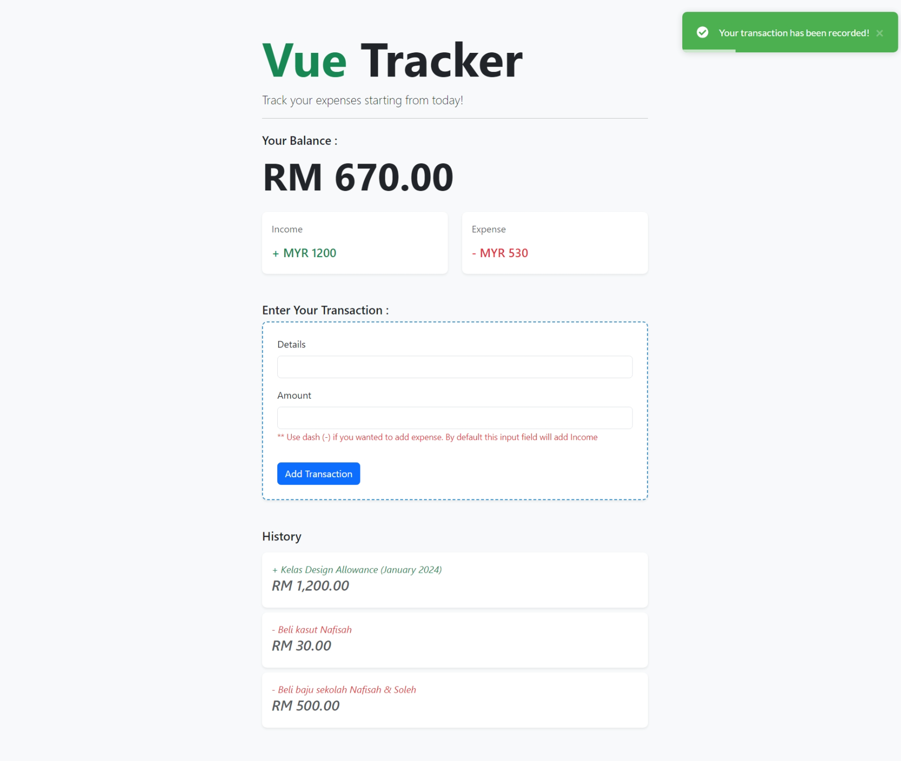

# Vue Tracker

Simple application to track your expenses. Built using Vue.js

### Things I learn

1. Vue.js Version 3.2
2. Vue.js best practices for Folder Structuring
3. Vue Components & templates
4. Create & Import Components
5. Global State
6. Props
7. Computed Properties
8. v-model binding
9. Validation and how to use other packages
10. Emit custom events
11. Vue State
12. Vue LocalStorage
13. And many more..

### Example

